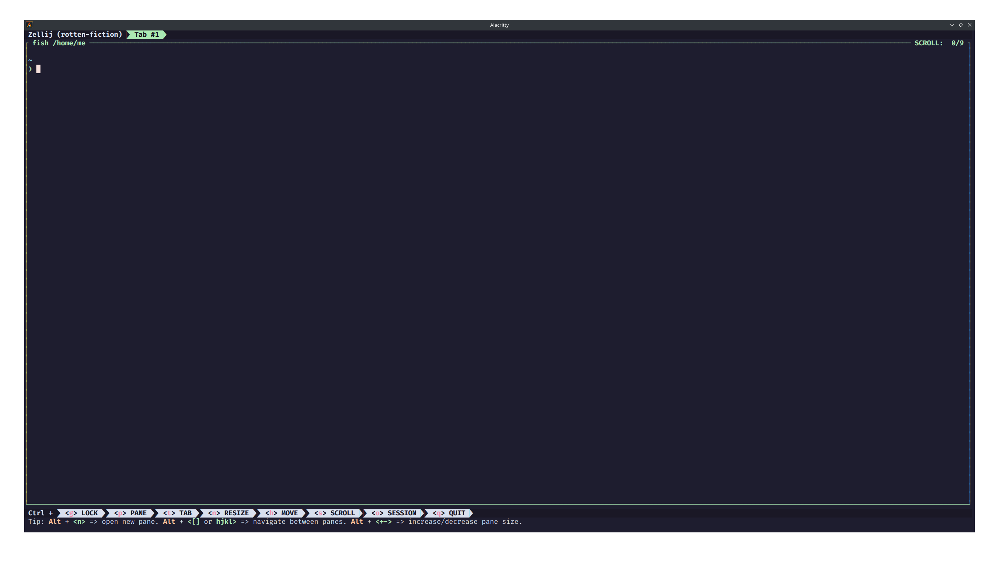

<h3 align="center">
	 
	
	Catppuccin for <a href="https://github.com/zellij-org/zellij">Zellij</a>
	
</h3>

    
    
    

  

## Usage

**There are two ways to use this colour scheme:**

**Using zellij configuration file**

1. Copy the contents of [`catppuccin.yaml`](https://github.com/catppuccin/zellij/blob/main/config.yaml) into your own zellij configuration file. The `catppuccin` entry inside of `themes` can be added to your already existing themes.
2. Set the line `theme: catppuccin-macchiato` to match your desired flavour. (latte, frappe, macchiato, mocha)

**Using themes directory**

1. Clone this repository locally, or download `catppuccin.yaml` directly.
2. Move `catppuccin.yaml` to the `~/.config/zellij/themes` directory.
3. Set the line `theme: catppuccin-macchiato` to match your desired flavour. (latte, frappe, macchiato, mocha)

> Or you can choose a theme directly from the command line `zellij options --theme catppuccin-macchiato`.

## 💝 Thanks to

-   [mainrs](https://github.com/mainrs)

&nbsp;

Copyright &copy; 2021-present <a href="https://github.com/catppuccin" target="_blank">Catppuccin Org</a>

