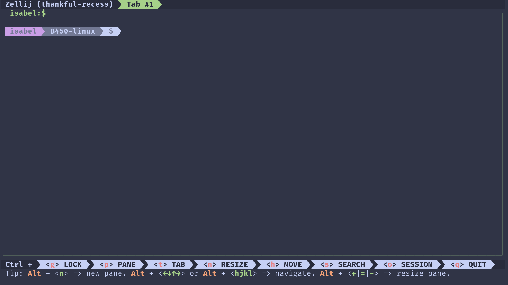

<h3 align="center">
	<br/>
	
	Catppuccin for <a href="https://github.com/zellij-org/zellij">Zellij</a>
	
</h3>

<p align="center">
    <a href="https://github.com/catppuccin/zellij/stargazers"></a>
    <a href="https://github.com/catppuccin/zellij/issues"></a>
    <a href="https://github.com/catppuccin/zellij/contributors"></a>
</p>

<p align="center">
  
</p>

## Previews

<details>
<summary>🌻 Latte</summary>

</details>
<details>
<summary>🪴 Frappé</summary>

</details>
<details>
<summary>🌺 Macchiato</summary>

</details>
<details>
<summary>🌿 Mocha</summary>

</details>

## Usage

> Catppuccin is included in Zellij. More information about the zellij theme can be found in the [theme-gallery](https://zellij.dev/documentation/theme-gallery.html#catppuccin-latte)

1. Edit your zellij [configuration](https://zellij.dev/documentation/configuration.html) file.
2. Set `theme` to your preferred flavor.
```kdl
theme "catppuccin-mocha" // or latte, frappe and macchiato
```

Or it can be applied via CLI options `zellij options --theme catppuccin-mocha`.

## 💝 Thanks to

-   [mainrs](https://github.com/mainrs)
-   [jaeheonji](https://github.com/jaeheonji)

&nbsp;

<p align="center"></p>
<p align="center">Copyright &copy; 2021-present <a href="https://github.com/catppuccin" target="_blank">Catppuccin Org</a>
<p align="center"><a href="https://github.com/catppuccin/catppuccin/blob/main/LICENSE"></a></p>
